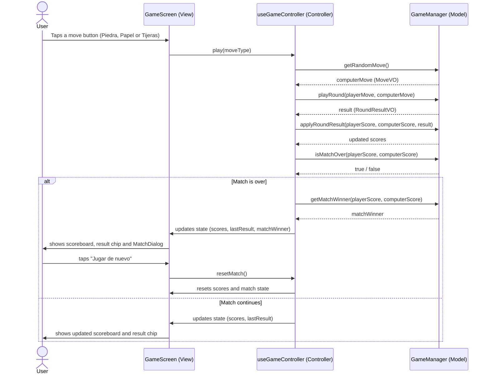

# Piedra, Papel o Tijera
 
This project was created with Expo using the following command:
 
```
npx create-expo-app@latest piedra-papel-tijera --template blank
```
 
The app uses a blank Expo template, which provides a minimal React Native project structure ready to run and customize.
 
## What is React Native?
 
React Native is a framework for building mobile applications using JavaScript and React. It lets you create native-like apps for iOS and Android from a single codebase.
 
## What is Expo?
 
Expo is a set of tools and services built on top of React Native that makes mobile app development faster and easier. It provides a managed workflow, prebuilt libraries, and a simple way to run and test apps on devices and simulators.
 
## What is React Native Paper?
 
React Native Paper is a UI library for React Native that provides ready-to-use components such as buttons, text inputs, dialogs, and typography following Material Design. It helps build a more polished and consistent mobile interface without having to create every visual element from scratch.
 
## Libraries added to the project
 
The following libraries were added to improve the UI and app structure:
 
* **React Native Paper**: added to provide Material Design components for the game screen (`Appbar`, `Surface`, `TouchableRipple`, `Chip`, `Dialog`, `Text`).
* **React Native Safe Area Context**: added to handle safe areas on devices with notches or rounded corners.
They were installed with the following commands:
 
```
npm install react-native-paper
npm install react-native-safe-area-context
```
 
## Styling in React Native Paper
 
React Native Paper components can be styled using the `style` prop, just like other React Native components. In this project, styles were added through `StyleSheet` definitions to keep the layout organized and easier to maintain.
 
The app also defines a custom Paper theme (purple primary color) in `App.js`, used to style the `Appbar.Header` and match the provided mockup.
 
For example, components such as `Text`, `Chip`, `Dialog`, and `Surface` receive visual properties like `backgroundColor`, `color`, `padding`, `margin`, and `borderRadius` through the `style`/`textStyle` props or through a shared style object.
 
This approach was used to define the header, the scoreboard, the move buttons, the result chip, and the end-of-match dialog.
 
## Test Driven Development (TDD)
 
TDD is a development approach where tests are written first, then the implementation is added to make those tests pass. This helps define the expected behavior clearly before changing the code.
 
For this project, any new feature or change should follow TDD: first add or update the relevant test case, run the tests to confirm the failure, then implement the smallest change needed to make the test pass.
 
## MVC pattern in this example
 
MVC stands for Model-View-Controller. It is a software design pattern that separates an application into three main parts:
 
* **Model**: contains the business logic and the data structures. In this app, the game rules live in the model layer, through `GameManager` and the value objects `MoveVO` and `RoundResultVO`. `GameManager` decides the round winner, generates the computer's move, applies the round result to the score, and determines when the match is over and who won it.
* **View**: is the part that the user sees and interacts with. In this project, `GameScreen` and its components (`ScoreBoard`, `MoveButton`, `ResultPill`, `MatchDialog`) render the UI and display the scoreboard, the move buttons, and the result.
* **Controller**: manages the flow between the view and the model. In this example, the custom hook `useGameController` acts as the controller by receiving the user's move, invoking the game logic in `GameManager`, and updating the screen state. This structure helps keep the code organized, easier to understand, and simpler to maintain.
 
## UML sequence diagram of the application flow
 
This diagram uses Mermaid syntax to represent the interaction between the user, the screen, the controller logic, and the model layer in a UML-style sequence flow.
 

 
## Project structure
 
```
models/
  valueobjects/
    MoveVO.js          # Represents a move (PIEDRA, PAPEL, TIJERAS)
    RoundResultVO.js    # Represents the outcome of a round
  managers/
    GameManager.js       # All the game logic
hooks/
  useGameController.js   # Controller: wires the view to the model
screens/
  GameScreen.js           # Main screen (View)
components/
  ScoreBoard.js
  MoveButton.js
  ResultPill.js
  MatchDialog.js
assets/
  icons/                  # Piedra / Papel / Tijeras icons
__tests__/
  GameManager.test.js     # Unit tests for the game logic
```
 
## Run the tests
 
To execute the test suite, run:
 
```
npm test
```
 
Jest was installed as a development dependency to support the test suite for this project. The tests cover all 9 possible move combinations, the score update logic, and the match-over / match-winner rules.
 
## Environment used
 
The project was created with the following tool versions:
 
* Node.js: v24.19.0
* npm: 11.17.0
* Expo SDK: ~54.0.36
* React Native: 0.81.5
Expo SDK 54 was used because it is the version currently configured in the project dependencies and is compatible with the modern Expo/React Native stack used by this app.
 
## Run the application
 
Install dependencies:
 
```
npm install
```
 
Start the Expo development server:
 
```
npm start
```
 
This will open the Expo developer tools in your browser and provide a QR code for testing on a device.
 
### Run on Android Studio emulator
 
1. Open Android Studio.
2. Start an Android emulator.
3. In the terminal, run:
```
npm run android
```
 
Expo will connect to the running emulator and launch the app.
 
### Run on Xcode simulator
 
1. Open Xcode.
2. Start an iOS simulator.
3. In the terminal, run:
```
npm run ios
```
 
Expo will build and launch the app on the iOS simulator.
 
### Run with Expo Go
 
1. Install Expo Go on your phone from the App Store or Google Play.
2. Make sure your phone and computer are on the same network.
3. Run:
```
npm start
```
 
4. Scan the QR code shown in the terminal or browser with Expo Go.
## Notes
 
If you want to open the app in a browser as well, you can run:
 
```
npm run web
```